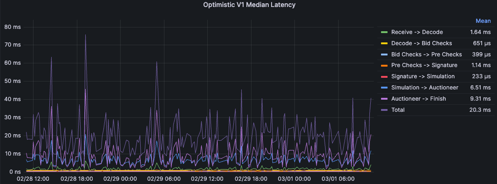
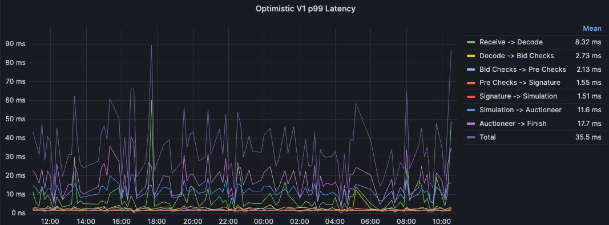

# Helix 🧬 - A Rust based high-performance MEV-Boost Relay 

## About Helix

Helix is a Rust-based MEV-Boost Relay implementation developed as an entirely new code base from the ground up. It has been designed with key foundational principles at its core, such as modularity and extensibility, low-latency performance, robustness and fault tolerance, geo-distribution, and a focus on reducing operational costs.

Our goal is to provide a code base that is not only technologically advanced but also aligns with the evolving needs of proposers, builders, and the broader Ethereum community.

## Key Features:

### Optimised Relay Flows

The PBS relay operates using two distinct flows, each with its own unique key requirements:
- **Submit_block -> Get_header Flow (Latency):** Currently, this is the only flow where latency is critically important. Our primary focus is on minimising latency while considering redundancy as a secondary priority. Future enhancements will include hyper-optimising the `get_header` and `get_payload` flows for latency (see the Future Work section for more details).
- **Get_header -> Get_payload Flow (Redundancy):** Promptly delivering the payload following a `get_header` request is essential. A delay in this process risks the proposer missing their slot, making high redundancy in this flow extremely important.

### Geo-Distribution and Global Accessibility: 
The current Flashbots MEV-Boost relay [implementation](https://github.com/flashbots/mev-boost-relay) is limited to operating as a single cluster. As a result, relays tend to aggregate in areas with a high density of proposers, particularly AWS data centres in North Virginia and Europe. This situation poses a significant disadvantage for proposers in locations with high network latency in these areas. To prevent missed slots, proposers in such locations are compelled to adjust their MEV-Boost configuration to call `get_header` earlier, which leads to reduced MEV rewards. In response, we have designed our relay to support geo-distribution. This allows multiple clusters to be operated in different geographical locations simultaneously, whilst collectively serving the relay API as one unified relay endpoint.

- Our design supports multiple geo-distributed clusters under a single relay URL.
- Automatic call routing via DNS resolution ensures low latency communication to relays.
- We've addressed potential non-determinism, such as differing routes for `get_header` and `get_payload`, by implementing the `GossipClientTrait` using gRPC, which ensures payload availability across all clusters.

### Censoring/ Non-Censoring Support
Operating censoring and non-censoring relays independently results in doubling the operational costs. To address this, we have integrated both functionalities into a single relay, aiming to reduce overhead and streamline operations.
- Censoring and non-censoring have been unified into a single relay by allowing proposers to specify “preferences” on-registration.
- To ensure ease of adoption, we allow proposers to communicate this binary decision by using two different URLs ([titanrelay.xyz](titanrelay.xyz) and [censoring.titanrelay.xyz](censoring.titanrelay.xyz)), registrations to either of these URLs will automatically set the preferences. All other calls will be routed in exactly the same way.
- On the builder side, there's a requirement to adapt to these changes as the [proposers](https://flashbots.github.io/relay-specs/#/Builder/getproposers) API response will now contain an extra `preferences` field. Minor changes are also required to the internal logic, as censoring moves from a per-relay basis to a per-validator basis.

### Modular and Generic Design
- Emphasising generic design, Helix allows for flexible integration with various databases and libraries. 
- Key Traits include: `Database`, `Auctioneer`, `Simulator` and `BeaconClient`.
- The current `Auctioneer` implementation supports Redis due to the ease of implementation when synchronising multiple processes in the same cluster. 
- The `Simulator` is also purposely generic, allowing for implementations of all optimistic relaying implementations and different forms of simulation. For example, communicating with the execution client via RPC or IPC.

### Optimised Block Propagation
- To ensure efficient block propagation without the need for sophisticated Beacon client peering, we've integrated a `Broadcaster` Trait, allowing integration with network services like [Fiber](https://fiber.chainbound.io) and [BloXroute](https://bloxroute.com) for effective payload distribution.
- Similar to the current MEV-Boost-relay implementation, we include a one-second delay before returning unblinded payloads to the proposer. This delay is required to mitigate attack vectors such as the recent [low-carb-crusader](https://collective.flashbots.net/t/disclosure-mitigation-of-block-equivocation-strategy-with-early-getpayload-calls-for-proposers/1705) attack. Consequently, the relay takes on the critical role of beacon-chain block propagation.
- In the future, we will be adding a custom module that will handle optimised peering

## Latency Analysis

*These latency measurements were taken on mainnet over 6 days handling full submissions from all Titan clusters.*

Analysing the latency metrics presented, we observe significant latency spikes in two distinct segments: `Receive -> Decode` and `Simulation -> Auctioneer`.

`Receive -> Decode`. The primary sources of latency can be attributed to the handling of incoming byte streams and their deserialisation into the `SignedBidSubmission` structure. This latency is primarily incurred due to the following:

- Byte Stream Processing: The initial step involves reading the incoming byte stream into a memory buffer, specifically using `hyper::body::to_bytes(body)`. This step is necessary to translate raw network data into a usable byte vector. Its latency is heavily influenced by the size of the incoming data and the efficiency of the network I/O operations.
- GZIP Decompression: For compressed payloads, the GZIP decompression process can introduce significant computational overhead, especially for larger payloads.
- Deserialisation Overhead: This is the final deserialisation step, where the byte vector is converted into a `SignedBidSubmission` object using either SSZ or JSON.

`Simulation -> Auctioneer`. In this section, we store all necessary information about the payload, preparing it to be returned by `get_header` and `get_payload`. This is handled using Redis in the current implementation, which can introduce significant latency, especially for larger payloads.

It is worth mentioning that all submissions during this period were simulated optimistically. If this weren’t the case, we would see most of the latency being taken up by `Bid checks -> Simulation`.

## Future Work

### OptimisticV2
[OptimisticV2](https://frontier.tech/optimistic-relays-and-where-to-find-them) introduces an architectural change where the lightweight header (always less than 1 [MTU](https://www.cloudflare.com/en-gb/learning/network-layer/what-is-mtu)) is decoupled from the much heavier payload. Due to the much smaller size, the header can be quickly downloaded, deserialised and saved, ready for `get_header` responses. Meanwhile, the much heavier full `SignedBidSubmission` is downloaded and verified asynchronously.

We plan to implement two distinct endpoints for builders: `submit_header` and `submit_payload`. Builders will be responsible for ensuring that they only use these endpoints if their collateral covers the block value and that they submit payloads in a timely manner to the relay. Builders that fail to submit payloads will have their collateral slashed in the same process as the current Optimistic V1 implementation.

Along with reducing the internal latency, separating the header and payload will drastically reduce the network latency. We should see end-to-end latencies reduce even further than the values shown in the graphs.

### In-Memory Auctioneer
In multi-relay cluster configurations, synchronising the best bid across all nodes is crucial to minimise redundant processing. Currently, this synchronisation relies on Redis. While the current `RedisCache` implementation could be optimised further, we plan on shifting to an in-memory model for our Auctioneer component, eliminating the reliance on Redis for critical-path functions.

Our approach will separate `Auctioneer` functionalities based on whether they lie in the critical path. Non-critical path functions will continue to use Redis for synchronisation and redundancy. However, critical-path operations like `get_last_slot_delivered` and `check_if_bid_is_below_floor` will be moved in-memory. To ensure that we minimise redundant processing, each header update will gossip between local instances.

It is worth mentioning that most of the critical path `Auctioneer` latency will be removed with OptimisticV2 as most of the Redis calls will be done in the asynchronous `submit_payload` flow. 

### Optimised beacon client peering
As stated in the "Optimised Block Propagation" section, we plan to develop a module dedicated to optimal beacon client peering. This module will feature a dynamic network crawler designed to fingerprint network nodes to enhance peer discovery and connectivity.

### PEPC
In line with the design principles of Protocol Enforced Proposer Commitments (PEPC) [PEPC](https://ethresear.ch/t/unbundling-pbs-towards-protocol-enforced-proposer-commitments-pepc/13879), we aim to offer more granularity in allowing proposers to communicate their preferences regarding the types of blocks they wish to commit to. Currently, this is achieved through the `preferences` field, which enables proposers to indicate whether they prefer to commit to non-censoring or censoring blocks. In the future, we plan to support additional preferences, such as commitment to blocks adhering to relay-established inclusion lists, blocks produced by trusted builders, and others.

## Compatability
- For proposers, Helix is fully compatible with the current MEV-Boost relay spec.
- For builders, there's a requirement to adapt to these changes as the [proposers](https://flashbots.github.io/relay-specs/#/Builder/getproposers) API response will now contain an extra `preferences` field. Minor changes are also required to the internal logic, as censoring moves from a per-relay basis to a per-validator basis.

## Credit to:
Flashbots:
- https://github.com/flashbots/mev-boost-relay

Alex Stokes. A lot of the types used are derived/ taken from these repos:
- https://github.com/ralexstokes/ethereum-consensus
- https://github.com/ralexstokes/mev-rs
- https://github.com/ralexstokes/beacon-api-client

## Audits
- Audit conducted by Spearbit, with [Alex Stokes](https://github.com/ralexstokes) (EF) and [Matthias Seitz](https://github.com/mattsse) (Reth, Foundry, ethers-rs) leading as security researchers. See the report [here](audits/spearbit-audit.pdf).

## License
MIT + Apache-2.0

## Contact
https://twitter.com/titanbuilderxyz
